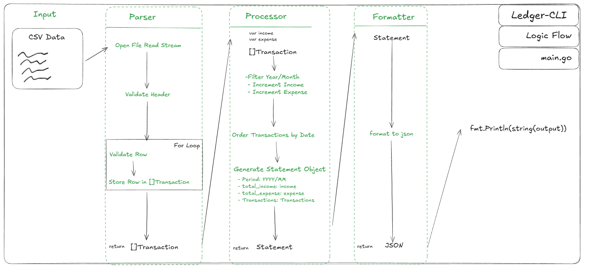
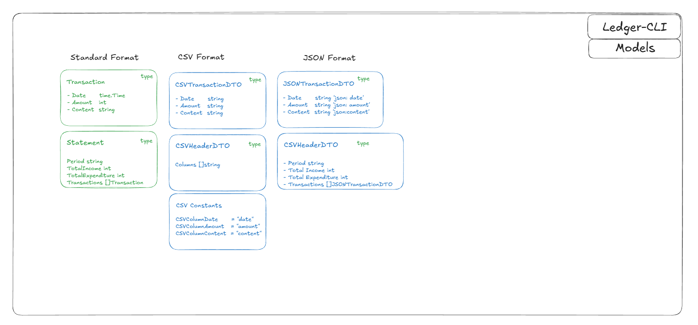

# Thought Process

After reading the assignment details, my initial thoughts were that we are going to need a modular system. When looking at the inputs and outputs of this assignment, my mental model looked like this:

### Input: CSV Files

- with the idea that we could support more file formats in the future.

### Business Logic: Process Ledger

- Generate a history of all deposits and withdrawals for a specified month.

### Output: Standard Output

- with the idea that in the future we might want to output to different file types or locations.

So now, if we were to put the entire process into simpler words, we could say we are taking some input and converting it into a ledger, processing the ledger, and outputting the historical results. Looking at this simplified view, we see we have 3 distinct layers here: parsing input, processing ledger, and formatting output.

We can see that it needs a swappable input and output, but the business logic and processing remain the same. This type of program is going to benefit from the Extract Transform Load (ETL) style architecture for the data flow and the Strategy Pattern for swapping inputs/outputs and even swappable processing logic in the future if needed. For me, my thought process really revolves around putting the problem into as simple words as possible and then seeing what patterns naturally jump out to me from that. My golden rule for myself is that if I can explain the process to a 5-year-old, then I truly understand it in its entirety.

# Technology Choices

Now that we have identified the flow of the architecture we want, the patterns we will be using, and our business constraints, we can pick a language that best suits the problem and a build system that makes sense for this language and problem.

### Language: Golang

The reason I picked Golang is that it is an incredibly performant language, has fast compilation times, and has very strong handling of concurrent data processing. This entire problem revolves around taking in data from a file, validating its completeness, processing its records, and outputting to the console, all from the CLI. Golang is probably one of, if not the best, languages for building CLI applications. As well as Golang, it is just an extremely performant language all around. So considering we are building a CLI application, and we are doing CPU-heavy tasks, Golang was a great choice here for this problem.

### Build System: Makefile

Makefile was chosen for the build system as it's simple and provides consistency for development, testing, and deployment. Makefile is particularly well paired with Golang because Golang compiles its project into a single binary file. We can use that single binary to run our entire application. So knowing Golang is simple in that regard; Makefile is a natural complement to it because Makefile allows us to set up a single file with all of our commands and variables plainly laid out, as well as the actual Go commands in-line. Just having this simplicity helps so much as a developer supporting this type of application in the future because there is no ambiguity in our process. We can see exactly what is going on, what commands are being run, and what/where our outputs are going.

# Design Decisions

Like I mentioned before in the Thought Process section, I went with the ETL pattern for the data process and the Strategy pattern for the implementation of the ETL components. The reason I chose these design patterns is that they follow the natural flow of the problem we are trying to solve. At the end of the day, the problem statement is saying: Extract a file for input, transform its contents, and load the results somewhere. That problem aligns perfectly with ETL, so the choice here was pretty obvious to me. As for the Strategy Pattern, well, when we look at the fine details in the problem, we see statements like "The program should be flexible enough to accommodate future changes in specifications, such as outputting data to a file," "Path to the file that records the history of wallet deposits and withdrawals," and "Please ensure the program handles all potential errors appropriately." This signals to me that we want to easily accommodate new file formats for the input and output, so we will need our system to be highly composable. It should be designed simply but strongly typed so that when we add in new parsers or formatters, they follow our expected application flow, and they can contain their own validation logic that is specific to the file formats we support. So below is basically the overarching flow:

Parser -> Processor -> Formatter

We know Parser is going to need a CSV parser, and potentially more, so I set up a base Parser interface that expects a Parse function to return an array of models. Transaction. This allows us to make a CSVParser that adheres to the Parser interface, or in the future a JSON Parser that adheres to the interface, and then in our main. Go logic; we just need to know which type of file format the user is giving us, and we create the parser from that and call the parse function to generate our ledger. We can only do that with the help of the interface since that contract forces all parsers to have that function. The real beauty of it is that all of the specific file format logic and validations are contained in their own classes, and our main doesn't care as long as the end result is that we have a class that has a Parse function that gives us an array of models. Transaction!

Processor is exactly like our Parser. We have a processor interface; it expects a process function that takes in []models. Transaction and returns models. Statement. So just like the parser, we don't care about how a processor's logic works; we just know that we are going to have a Process function that takes in transactions and produces a statement. So in the future, if we need to use different processing logic, all we need to do is make a new processor, and everything else stays the same. Isn't that beautiful?

Formatter, as you can probably guess, is exactly like the Parser and Processor. Interface and function with guaranteed inputs and outputs. This gives us the composability to allow us as devs to easily create new output options for the users, and the users get more choices for how the file can be output. A win-win for everyone.

The reporter is one thing not explicitly shown in the above diagram but needs to be mentioned here in the design. With our strategy pattern, the actual fine-grained details live within the parser, processor, and formatter classes. How we handle a CSV input file is different than a JSON input file. We need to validate the files differently, access the file readers differently, and so forth. One thing to make our system more unified is to have a common reporter that will output errors that fail our validations so that we know the type of validation it failed and where in the code it failed. The Reporter is set up to capture and report errors on the common failure points in our flow, namely: row validation failures, file failures, processing failures, and formatting failures. The ETL classes require a reporter. This forces our code to inject a reporter into our process, and in doing so, that has given us an easy and clear way to bubble up useful errors to the top of the application to output to the user.

Another desing choice that can't be directly expressed in the above diagram is the DTO usage. DTO is data transfer object. How I used this is that we have the general model types (Transaction, Statement), and our auxilliary inputs/outputs (CSV, JSON, etc). What we can do with the DTO, is describe how the incoming CSV will look like and what structure it needs to follow, and we can take that parsed CSV to ensure it fits the DTO (validation), and than we map that CSV DTO to our Transaction model. This gives us a very obvious flow of how the data is transformed and moving across our system. We can setup DTO models for any new incoming file types we want to support for input and output.

# Requirement Fulfillment

- [x] CSV Json Support for input and output—fulfilled by parsers and formatters

- [x] Period Filtering - Fulfilled by processors

- [x] Aggregation Logic—Fulfilled by Processors

- [x] Error Handling—Fulfilled by Reporter + class-by-class validation logic. I.e., CSVParser handles CSV file error handling and row validations and reports errors through Reporter. Meaning unified error handling throughout our application.

Error handling is the biggest challenge of all of this. The reason being is that there's no real good way in Golang to enforce error handling standards. We really do have to rely on the devs making the new parsers/processors/formatters to use the reporter correctly and appropriately. This is something we are going to have to enforce through PR reviews and testing the code thoroughly.

# Future Work

In the future, there are a couple of things that jump out to me that I think can be done to make this application better. For one, which I think is necessary, if we have files that are decades old, meaning they have transactions going back years and years, they might be several gigabytes in size. We'd want to implement a worker pool and use goroutines to parse the file in chunks. This will give us dramatic performance improvements and a dramatic reduction in file operation times. Our code is fast and safe right now, and by safe I mean the CSV parser only takes in a CSV file stream and will not load the entire file into memory so that we don't explode our memory on a large file. But currently it's reading one line and doing the validation logic at the same time. If we implement goroutines, we could have a producer goroutine read line by line, and for every line just send it into the jobs channel for other goroutines to do the actual parsing and validation logic. This would dramatically reduce operation times since we could have hundreds or thousands of goroutines doing the validation logic. I think this is a necessary upgrade for the future because it will happen someday that someone will use it with a huge file.

Another future improvement would be to allow files from outside our local machine and output files to a database or other system. That would be a really nice upgrade because users could store their CSV records in the cloud somewhere and output their results to the cloud or even output those results to another machine to do some analysis on their outputted results. That could probably turn this entire application into a business.

# Diagrams





# How To Use

To build and run this project, you need Go installed (1.25.3).

### Use the Makefile to compile the application

```bash
make build
```

### Run the Application

```bash
./ledger-cli -file ./test_data/given.csv -period 202201
```
